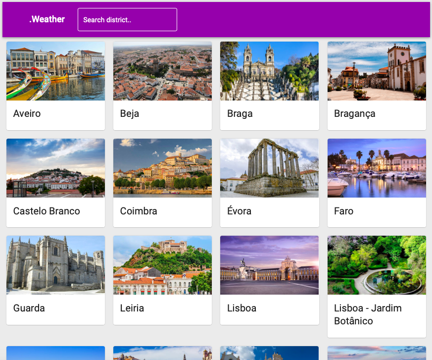
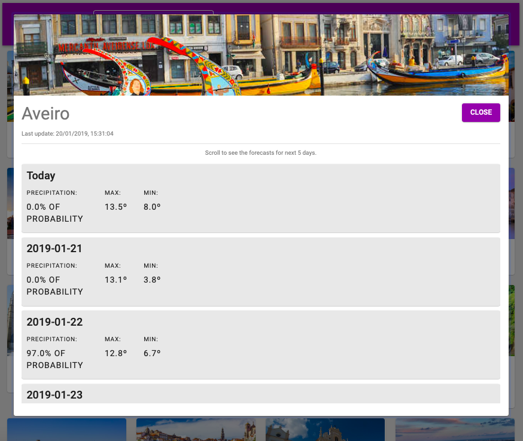

# dottWeather

This web app was made in ReactJS with the purpose to show all Portugal's regions and the weather forecast for each one. 

### Some implementation details
To build this app was used three react libraries and [IPMA API](http://api.ipma.pt/open-data/distrits-islands.json). 
React Libraries:
* [Create-React-App](https://github.com/facebook/create-react-app);
* [Material-UI](https://material-ui.com);
* [Styled-Components](https://www.styled-components.com).

### Installation & Development

1. clone this repo: `git clone https://github.com/renatogslopes/dottWeather.git`
2. `cd dottweather`
3. `npm install`
4. run `npm start` from a terminal and it'll run on [http://localhost:3000](http://localhost:3000) 
5. The app will automatically reload if you change any of the source files.

## .Weather - What you'll see. 
Main Page

Details Page

## To improve in the future

1. Implement the Redux.
2. Convert the images to SVG.

## Author
Renato Lopes 

